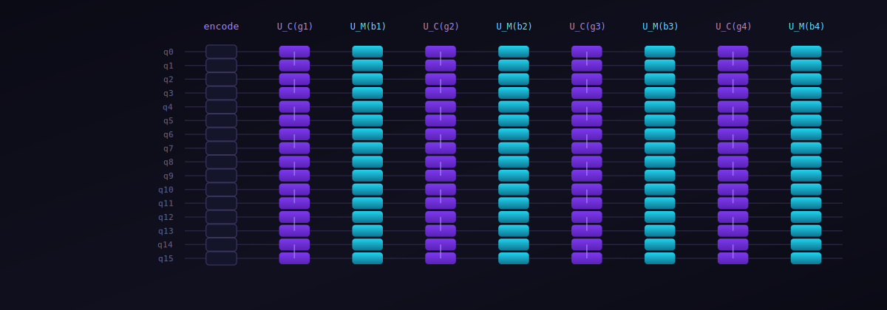
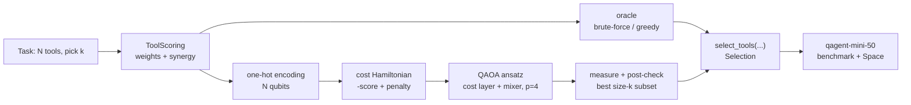

<div align="center">



# QAgent

**Quantum-optimized tool selection for LLM agents.**
Pick the best subset of *k* tools from *N* candidates with QAOA.

[](https://github.com/Quantum-Labor/qagent/actions/workflows/tests.yml)
[](https://github.com/Quantum-Labor/qagent/actions/workflows/lint.yml)
[](https://github.com/Quantum-Labor/qagent/actions/workflows/deploy-space.yml)
[](CHANGELOG.md)
[](LICENSE)
[](#the-quantum-co-processor-program)
[](https://huggingface.co/spaces/Laborator/qagent)

</div>

---

An agent with many tools must choose a few. The best choice is not "the top-*k*
most relevant" — tools interact (some synergise, some are redundant), so the
optimal set is a combinatorial optimization, not a ranking. QAgent casts
"pick *k* of *N* tools" as a constrained quadratic objective and solves it with the
Quantum Approximate Optimization Algorithm on a simulator, with exact and greedy
classical baselines to measure against.

## Try it now

**[Open the live demo on Hugging Face → huggingface.co/spaces/Laborator/qagent](https://huggingface.co/spaces/Laborator/qagent)**

Explore all 50 benchmark tasks, see which tools each solver picks on a 4×4 grid,
watch where QAOA lands in the full score landscape, and verify the numbers live.

```python
from qagent import ToolScoring, select_tools

# 4 tools, pick 2. Tools 2 and 3 are mid-relevance but synergistic,
# so {2, 3} beats the two highest-relevance tools {0, 1}.
scoring = ToolScoring(
    weights=(0.9, 0.85, 0.5, 0.5),
    synergy=((0, 0, 0, 0), (0, 0, 0, 0), (0, 0, 0, 1.0), (0, 0, 1.0, 0)),
)
print(select_tools(scoring, k=2, backend="classical").subset)  # frozenset({2, 3})
print(select_tools(scoring, k=2, backend="qaoa", p=2).subset)   # frozenset({2, 3})
```

## What is this?

When an LLM agent has access to *N* tools but should only be handed *k* of them —
to fit a context budget, cut cost, or reduce confusion — which *k*?

Picking the *k* individually-most-relevant tools is greedy and often wrong, because
tools have **pairwise interactions**. A retriever plus a summariser synergise; two
overlapping search tools are redundant. The value of a tool set is

```
score(S) = sum_{i in S} relevance[i]  +  sum_{i<j in S} interaction[i][j]
```

and the task is to maximise it subject to `|S| = k`. That is a quadratic binary
optimization with a cardinality constraint — exactly the structure QAOA is built
for. QAgent is the second of three projects exploring where a small quantum
subroutine can sit behind a stable classical interface in an LLM stack.

## How it works (in 30 seconds)

- **Encode** the task as per-tool relevances and a pairwise interaction matrix.
- **Map** "select k of N" to *N* qubits (one-hot: qubit *i* = tool *i* in/out),
  folding the cardinality constraint into the cost Hamiltonian as a penalty.
- **Optimize** a QAOA ansatz (cost layer + mixer) with PyTorch on the PennyLane
  simulator; measure and keep the best valid subset.
- **Compare** against an exact brute-force oracle and a greedy top-*k* baseline.

<details>
<summary><b>More detail: the cost Hamiltonian and mixers</b></summary>

The cost `-score(x) + λ·(|S| − k)²` is mapped to the Pauli-Z basis via
`x_i = (1 − Z_i)/2`, giving single-`Z` and `ZZ` terms whose ground state is the
optimal size-*k* subset. v0.2 sets the penalty `λ` to twice the best single-tool
marginal (tight enough to enforce `|S| = k` without washing out the score signal),
trains `p = 4` layers for 160 Adam steps, and offers an X mixer (default) or a
Hamming-weight-preserving XY ring mixer (`mixer="xy"`). See
[docs/qaoa-explained.md](docs/qaoa-explained.md).
</details>

## Benchmarks

`qagent-mini-50`: 25 small tasks (N=8, k=3) + 25 full tasks (N=16, k=5), each with
relevances and a sparse interaction matrix, optimum verified by brute force.
Reproduce with `python scripts/run_benchmarks.py`.

| Group | Brute-force | Greedy top-k | QAOA (v0.2) |
| --- | --- | --- | --- |
| small (N=8, k=3) | 100% | 24% | **100%** |
| full (N=16, k=5) | 100% | 0% | 4% |
| **all** | **100%** | **12%** | **52%** |

Exact-match alone understates the story; the **mean approximation ratio**
(`score / optimal`) is where the v0.2 fixes show:

| Group | Greedy | QAOA (v0.2) |
| --- | --- | --- |
| small (N=8, k=3) | 0.897 | 1.000 |
| full (N=16, k=5) | 0.735 | **0.915** |
| **all** | 0.816 | **0.957** |

Greedy is weak by construction — it ignores interactions, so it never recovers the
optimum at N=16. QAOA solves every small task exactly and recovers ~92% of the
optimal score at N=16, up from ~0.735 in v0.1 (where an oversized penalty washed
out the score signal). See [docs/benchmarks.md](docs/benchmarks.md).

## Architecture



## Limits (honest scope)

- **Simulator only.** `default.qubit`; this phase targets `N ≤ 16`. No real
  quantum hardware (that is QVerify's story).
- **Exact-match at N=16 is unsolved.** QAOA hits only 4% exact-match on the
  full tasks — finding the single best of 4368 size-5 subsets is beyond this
  depth. The documented next step is **Dicke-initialised XY-QAOA** (search the
  Hamming-weight-`k` subspace directly, no penalty), which the simple-init XY
  mixer in v0.2 approximates but needs deep `p` to mix.
- **No quantum advantage claimed.** At these sizes brute force is trivial; the
  value is the architecture and an honest, measured baseline, not a speed-up.

## Citation

```bibtex
@misc{brinza2026qagent,
  author       = {Serghei Brinza},
  title        = {QAgent: QAOA-based tool selection for LLM agents},
  year         = {2026},
  publisher    = {GitHub},
  howpublished = {\url{https://github.com/Quantum-Labor/qagent}},
}
```

## The Quantum Co-Processor program

Three projects exploring quantum subroutines behind classical LLM interfaces:

| | Project | What | Status |
| --- | --- | --- | --- |
| 1 | [QVerify](https://github.com/Quantum-Labor/qverify) | Grover-assisted verification of LLM reasoning | shipped ([Space](https://huggingface.co/spaces/Laborator/qverify)) |
| 2 | **QAgent** | QAOA tool selection (this repo) | v0.2 ([Space](https://huggingface.co/spaces/Laborator/qagent)) |
| 3 | [QRoute](https://github.com/Quantum-Labor/qroute) | VQC mixture-of-experts router | Phase 1 prototype |

## License

Apache 2.0. See [LICENSE](LICENSE).

## Author

Serghei Brinza ([@SergheiBrinza](https://github.com/SergheiBrinza))
